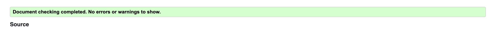
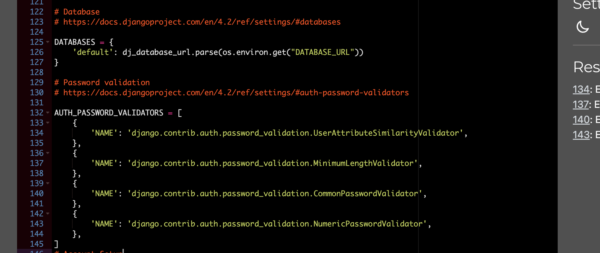
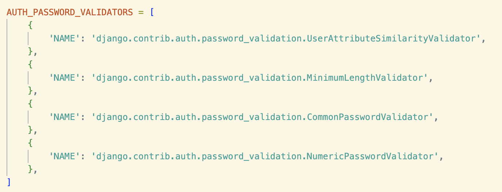
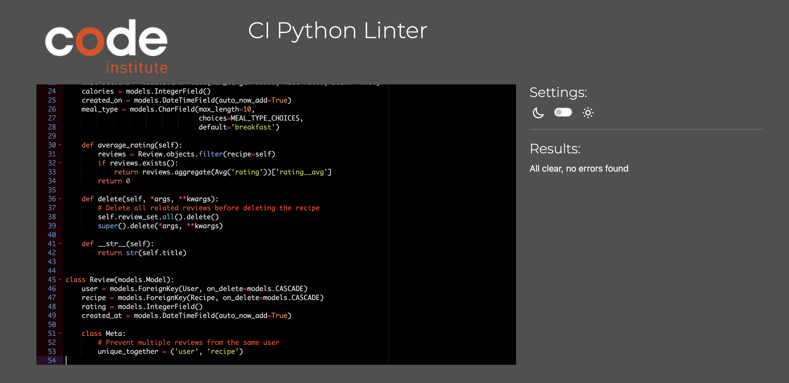
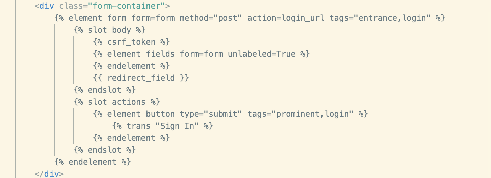
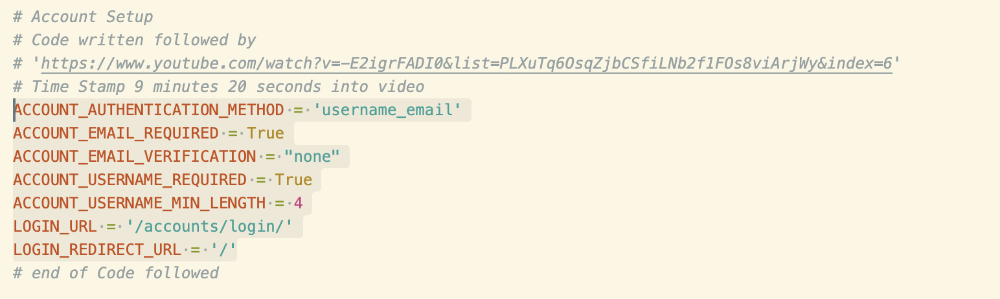
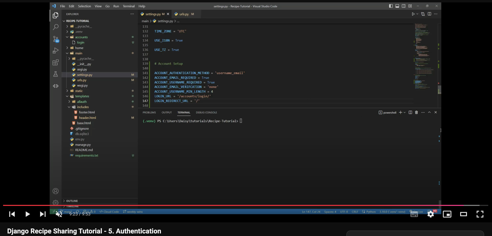

# Recipe Blog Project
### Introduction 
**Recipe Blog** is an interactive online platform that brings together food enthusiasts from around the world to share, discover, and celebrate culinary creations. The app allows users to create, edit, and manage their own recipes while exploring those shared by others. It also includes a rating and review system, enabling users to share feedback and discover top-rated recipes. With personalised profiles and an intuitive design, Recipe Blog offers a user-friendly experience for anyone looking to document their culinary adventures, try new dishes, and connect with a like-minded community. [Live Site - The Recipe Box](https://the-recipe-blog-2ab045f310be.herokuapp.com/)


## Table of Contents
- [User Experience Design](#user-experience-design)
  - [The Strategy](#the-strategy)
    - [Site Goals](#site-goals)
    - [Agile Planning](#agile-planning)
    - [Epics](#epics)
    - [User Stories](#user-stories)
  - [Scope](#the-scope)
  - [Structure](#structure)
    - [Features](#features)
    - [Features Left To Implement](#features-left-to-implement)
    - [Potential Future Features to Implement](#potential-future-features-to-implement)
  - [Skeleton](#the-skeleton)
    - [Wireframes](#wireframes)
    - [Database Design](#database-design)
    - [Security](#security)
  - [Surface](#surface)
    - [Design](#design)
    - [Colour Scheme](#colour-scheme)
    - [Typography](#typography)
    - [Imagery](#imagery)
- [Technologies](#technologies)
- [Testing](#testing)
- [Resubmission Changes](#resubmission)
- [Deployment](#deployment)
  - [Version Control](#version-control)
  - [Heroku Deployment](#heroku-deployment)
  - [Run Locally](#run-locally)
  - [Fork Project](#fork-project)
- [Credits](#credits)

## User Experience Design

### The Strategy

#### Site Goals
The **Recipe Blog** aims to provide a vibrant and engaging platform for users to share their culinary creations, explore new recipes, and connect with other food enthusiasts. The primary goals of the site include:

- **User-Friendly Experience**: To create an intuitive, accessible platform where users of all skill levels can easily navigate, share, and discover recipes. A streamlined design ensures that users can quickly find the features they need, whether they’re adding a new recipe, leaving a review, or browsing the latest dishes.

- **Recipe Sharing and Management**: To empower users to create, edit, and manage their own recipes. Each recipe entry is designed to be intuitive, allowing users to share their unique methods. Personal profile pages allow users to view and organize their recipes in one place, making it easy to revisit or modify their content.

- **Discovery and Exploration**: To inspire culinary discovery by enabling users to explore a wide variety of recipes shared by others. The platform offers filtering, allowing users to find recipes that match their preferences. A rating system allows users to provide feedback.

- **Community Interaction**: To foster a sense of community by allowing users to rate each other’s recipes. The platform encourages positive interactions, creating a collaborative space where users can learn, improve, and connect over shared culinary interests.

Through these goals, **Recipe Blog** aims to cultivate a welcoming environment where food enthusiasts can document their culinary journeys, discover new flavors, and engage in a meaningful community dedicated to the art of cooking.

#### Agile Planning
# Agile Approach

My Agile approach for this project followed a structured, iterative process that ensured flexibility, ongoing feedback, and regular progress evaluations. Below is an outline of the Agile methodology applied, including the planning, development, and deployment phases:

## 1. Project Planning and Requirement Gathering
- **Initial Requirements**: The project began by identifying key requirements, dividing them intoepics that align with core functionalities.
- **User Stories**: Each epic was broken down into user stories.
- **Prioritization**: User stories were prioritized based on their impact on the overall user experience and project timeline.

## 2. Sprint Planning
- **Defining Sprints**: The project was divided into manageable sprints, each focusing on completing a set of related user stories within an epic.
- **Sprint Goals**: Each sprint had a clear goal to deliver a specific feature or enhancement.
- **Task Estimation**: Tasks within each sprint were estimated for time and complexity, balancing workload to ensure steady progress without overloading.

## 3. Development and Iterative Testing
- **Incremental Development**: Features were developed incrementally, with individual tasks tackled in small, manageable units.
- **Regular Testing**: After each sprint, features were thoroughly tested to ensure they met the acceptance criteria. Testing included unit testing, integration testing, and user acceptance testing for specific functionality.

## 4. Final Testing and Deployment
- **Comprehensive Testing**: The project underwent comprehensive testing, covering functionality, responsiveness, and cross-browser compatibility.
- **Production Preparation**: Deployment tasks included setting up static file handling, configuring environment variables, and preparing database settings.
- **Deployment**: The final version was deployed to a live server (heroku).

### Sprints 

The development process for **Recipe Blog** was organized into four sprints, each planned and tracked using Jira. Each sprint focused on specific epics, allowing for a structured, iterative approach to completing the project’s key features and documentation.

#### Sprint Overview


#### Sprint 1: Epics 1 and 2 (October 24th - 27th)
The first sprint focused on laying the foundation of the project, covering **Epic 1** and **Epic 2**.

- **Sprint 1 Backlog**  
  

- **Sprint 1 Kanban Board**  
  

- **Sprint 1 Completed Tasks**  
  

#### Sprint 2: Epics 3 and 4 (October 28th - 30th)
The second sprint focused on **Epic 3** and **Epic 4**, covering key user functionality such as user registration, login, and CRUD operations for the menu items by staff.

- **Sprint 2 Progress**  
  

#### Sprint 3: Epics 5 and 6 (November 1st - 2nd)
In the third sprint, **Epic 5** (Booking) and **Epic 6** (Deployment) were the focus. This included implementing booking functionality, allowing users to create and manage reservations, and preparing the project for deployment to Heroku.

- **Sprint 3**  
  

#### Sprint 4: Epic 7 and README (November 3rd - 5th)
The final sprint was dedicated to **Epic 7** (Documentation) and final touches on the README. This ensured all documentation, including project details, user stories, and testing processes, was complete and aligned with the finished product.

- **Sprint 4**  
  

## Finished Timeline 


#### Epics
## Epic 1 - Base Setup
Set up the foundational project structure, including environment configuration, static files, and reusable templates for consistent design and functionality across the site.

## Epic 2 - User Account and Authentication
Implement user account creation, login, logout, and email verification features to ensure secure user authentication and access to personalized features.

## Epic 3 - Recipes and Profile Management
Enable users to create and view recipes and access a personalized profile page displaying their information and recipe submissions.

## Epic 4 - Recipe Management Features and Enhancements
Add editing, deleting, and reviewing features for recipes, along with meal type categorization, to enhance user interaction with recipes.

## Epic 5 - Home Page and Styling
Design and style the home page, navbar, and other static elements for visual consistency, usability, and responsiveness across all devices.

## Epic 6 - Refinements and Additional Features
Make final adjustments and add small features, such as recipe filtering, custom error pages, and data presentation enhancements.

## Epic 7 - Deployment
Prepare the project for deployment by configuring static file handling, setting up the production environment, and deploying to a live server.

#### User Stories
User stories can be found in the [user_stories.md](/user_stories.md) file, this was moved due to the size of the file. 

### Scope 

The **Recipe Blog** project is designed with a set of core features focused on providing users with an accessible and engaging platform for recipe sharing, discovery, and community engagement. The scope of the project centers around key functionalities that make it easy for users to manage their culinary content, interact with others, and explore a variety of recipes.

#### Core Features

1. **User Accounts and Authentication**  
   - **Description**: Registered users can log in, and manage their own content.
   - **Reason**: By providing secure user accounts, the platform ensures that users have a personalized experience, allowing them to manage their own content while preventing unauthorized access.

2. **Recipe Creation, Editing, and Deletion**  
   - **Description**: Registered users can create, edit, and delete their recipes, adding details like ingredients, instructions, and images..
   - **Reason**: This feature gives users a dedicated space to share their culinary creations within a space of like-minded people, or store their own recipes for future use, both fostering a sense of community and providing users with a virtual 'cook book'.

3. **Recipe Viewing and Exploration**  
   - **Description**: All users, whether logged in or not, can browse, search, and filter recipes by different meal types.
   - **Reason**: This allows users to easily discover new recipes.

4. **Rating and Review System**  
   - **Description**: Logged-in users can rate recipes created by others, with the average rating displayed on each recipe.
   - **Reason**: The rating system helps highlight popular recipes and provides valuable feedback to recipe creators.

5. **User Profiles**  
   - **Description**: Each user has a profile page displaying all the recipes they’ve created, allowing them to manage their own content.
   - **Reason**: This feature enhances personalization, allowing users to manage their contributions in one place, and makes it easy for them to showcase their culinary portfolio.

These features were chosen to balance functionality with usability, ensuring that users can easily share and explore recipes while enjoying the benefits of a supportive, interactive community.

### Structure

#### Features
- **Navbar**  
  - **Description**: A navigation bar is available at the top of every page, giving users quick access to main sections such as Home, Add Recipe, View All Recipes, and Login/Register, Log Out, Profile. The navigation adjusts based on the user’s login status: users who are not logged in will see options to sign in or create an account, while logged-in users will see options to access their profile and log out. Additionally, any attempt to access features requiring an account will automatically redirect users to the sign-up or login page, ensuring a smooth and intuitive experience.
  - **Purpose**: Provides a consistent and accessible navigation experience across devices, ensuring users can quickly find and navigate the site’s primary features.
  - **User Story**: As a user, I want a clear navigation menu so that I can easily find and access different parts of the website.
  - **Implementation**:
    - **Bootstrap Navbar Setup**: The navigation bar was built using Bootstrap’s navbar documentation as a foundation, ensuring responsiveness across different screen sizes and providing a familiar structure for easy navigation.
    - **Customization and Styling**: The navbar was then customized and styled to align with the site's visual identity and user experience goals. Colours, fonts, and spacing were modified to match the overall design theme, and custom CSS was applied to enhance the aesthetic and usability.
    - **Dynamic Links Based on User Status**: 
      - Conditional logic was implemented to display different navigation options based on the user’s login status. 
      - Logged-out users see options for signing in and creating an account, while logged-in users see links to their profile and a log-out option.
    - **Automatic Redirects**: For any actions requiring an account (like adding a recipe or leaving a review), users are automatically redirected to the login page.
    - **Dropdown Menu**: For smaller screen sizes a dropdown icon is displayed instead of the nav items, displaying a list of nav items, styled for a smaller screen size, this allows for a clean aesthetic across all screen types.

- **Navbar when Signed in**:

- **Navbar when Signed out**:

- **Navbar Dropdown**:


- **Footer**  
  - **Description**: The footer includes links to social media, appearing at the bottom of every page.
  - **Purpose**: The footer offers additional navigation options and information, enhancing user accessibility.
  - **User Story**: As a user, I want a footer with extra links so that I can quickly access more resources or reach out if needed.


- **View All Recipes**  
  - **Description**: A page displaying all recipes available on the platform, with options to filter recipes by meal type.
  - **Purpose**: Allows users to explore a wide variety of recipes, encouraging discovery.
  - **User Story**: As a user, I want to see a list of all recipes so that I can browse and find interesting dishes to try.


- **Recipe Detail Page**  
  - **Description**: A dedicated page displaying all details of a selected recipe. This page serves as a comprehensive view where users can fully explore a recipe and decide if they want to try it, additionally, for the owner of the recipe, options to edit or delete said recipe will be present, and they will not have access to the option to leave a review on their own recipe.
  - **Purpose**: The recipe detail page allows users to access all necessary information about a recipe in one place, supporting informed decisions and encouraging engagement through ratings.
  - **User Story**: As a user, I want to view all details of a recipe so that I can understand the ingredients and instructions before deciding to make it.
  - **Implementation**:
    - **Recipe Model Information**: The page displays all fields from the recipe model, including the title, providing users with a complete recipe overview.
    - **Ratings**: User ratings are prominently displayed, helping users gauge the recipe's quality based on community feedback.
    - **View and Template**: A Django view retrieves the recipe details and passes them to the template. The template is structured to showcase the recipe information clearly and highlight interactive elements like the rating, edit or delete features.
    - **User Interaction**: Logged-in users can leave a rating directly from this page, while users who are the author of the recipe will instead of being able to leave a rating, will have options to edit or delete the recipe 
    - **Navigation Options**: Links to go back to the list of all recipes or navigate to other areas of the site are included for ease of use.


- **Create an Account**  
  - **Description**: Users can register an account, providing them access to additional features like creating and reviewing recipes, provides success message upon account creation and sign in.
  - **Purpose**: Enables a personalized experience and grants access to interactive features, enhancing user engagement.
  - **User Story**: As a new user, I want to create an account so that I can add my own recipes and participate in the community.


- **Log In Page**  
  - **Description**: A simple and secure page where users can enter their credentials to access their account. The log-in page provides fields for a username and password.
  - **Purpose**: Allows registered users to authenticate themselves granting them access to their personalized account features, including creating and managing recipes, leaving reviews, and accessing their profile.
  - **User Story**: As a user, I want to log in to my account so that I can interact with the website fully.
  - **Implementation**:
    - **Form Fields**: Users are presented with fields for entering their username and password.
    - **Feedback**: If login fails, users receive an error message prompting them to recheck their credentials. Successful logins redirect users to the homepage or to the create a recipe page if the user had previously attempted to navigate to that page while not logged in.
    - **Password Recovery**: A link to reset a forgotten password is available to help users regain access to their account easily.
    - **Navigation**: Users not registered are encouraged to sign up through a link on this page, ensuring they know how to access the platform’s full features.


- **Sign Out Page**  
  - **Description**: A page or button that allows logged-in users to log out of their account, ending their session on the site.
  - **Purpose**: Enables users to sign out of their accounts when they’re finished using the site, helping to maintain privacy and security.
  - **User Story**: As a user, I want to log out of my account when I’m done to ensure my account remains secure.
  - **Implementation**:
    - **Log Out**: A button or link is available on the navigation bar, allowing users to log out with a single click.
    - **Redirect**: After logging out, users are redirected to the homepage, confirming that their session has ended.


- **Create a Recipe**  
  - **Description**: Allows logged in users to add new recipes by entering details such as the recipe title, ingredients, instructions, meal-type, calories, date of creation.
  - **Purpose**: This feature enables users to share their own culinary creations with the community, contributing to a diverse collection of recipes available on the platform.
  - **User Story**: As a user, I want to create a recipe so that I can share and store my cooking creations.
  - **Implementation**:
    - **Recipe Model**: A Django model was created to store recipe information.
    - **Recipe Creation Form**: Users access a form that allows them to input recipe details, which is only accessible to registered users to ensure that only authenticated users contribute content.
    - **View and Template**: A view handles the recipe creation process, validating inputs and saving data to the database. The template offers a clear, user-friendly interface to guide users in submitting their recipe.
    - **Feedback**: Upon successfully adding a recipe, users receive a success message to confirm that their recipe was added. If any input errors occur, users are notified to correct the entry before being able create it.


- **Edit Recipe**  
  - **Description**: Allows users to edit their own recipes, updating ingredients, instructions, or the image as needed.
  - **Purpose**: Allows users to keep their recipes up-to-date or refine them over time, enhancing the quality of the content on the platform.
  - **User Story**: As a user, I want to edit my recipes so that I can improve or update them based on feedback or new ideas.


- **Delete Recipe**  
  - **Description**: Users can delete any of their recipes, permanently removing them from the platform.
  - **Purpose**: Allows users to manage their content and remove recipes that they no longer wish to share.
  - **User Story**: As a user, I want to delete my recipes so that I can remove any recipes i no longer wish to share and store on the site.


- **Profile Page**  
  - **Description**: A page where logged in users can view their account information and see a list of all the recipes they have created. From here, they can also edit or delete their recipes, users who have not logged in will instead see navigation items to log in, or sign up in the profile links stead.
  - **Purpose**: The profile page provides users with a central hub to manage their contributions, allowing them to easily access, update, or remove their content as needed.
  - **User Story**: As a user, I want a profile page where I can see my account information and all of my recipes so that I can manage my content and keep track of my contributions.
  - **Implementation**:
    - **User Information Display**: Basic account information, such as the username, email, and date of account creation is displayed at the top of the profile page for easy access.
    - **Recipe List**: Below the account information for smaller screen sizes, and alongside it, a list of the user’s recipes is displayed. Upon clicking a recipe, the user is directed to the recipe detail page. Which shows the recipe information and has options to edit or delete the recipe.
    - **View and Template**: A Django view retrieves the logged-in user’s information and their associated recipes, passing them to the profile page template. The template is designed to clearly separate account details from the list of recipes.
    - **Edit and Delete Options**: For each recipe listed, users have buttons to edit or delete the recipe directly from the profile page, allowing for efficient content management without navigating to other pages.
    - **Feedback**: After editing or deleting a recipe, users receive a confirmation message, ensuring they know their action was successful.


- **Return Button**  
  - **Description**: A button that allows users to return to their previous page, located on pages such as recipe details or edit recipe, where users may want to navigate back to their previous view.
  - **Purpose**: The return button improves navigation by allowing users to easily return to where they came from without needing to use browser controls, enhancing user convenience and flow.
  - **User Story**: As a user, I want a “Return" button so that I can quickly return to the previous page.
  - **Implementation**:
    - **JavaScript Navigation**: The button uses JavaScript’s `history.back()` function, which takes the user back to their last visited page in the session history.
    - **Placement and Styling**: The button is styled to be easily visible but unobtrusive, located near the bottom of the page for intuitive access.


- **5-Star Rating System**  
  - **Description**: Allows logged-in users who are not the owner of a recipe to rate it on a scale of 1 to 5 stars. The site then calculates and displays the average rating of each recipe based on all user ratings.
  - **Purpose**: This feature enables community members to provide feedback and helps others identify popular, high-quality recipes. By displaying the average rating, it provides a quick visual indicator of a recipe’s overall quality.
  - **User Story**: As a user, I want to rate recipes I’ve tried so that I can share my feedback and help others discover quality dishes.
  - **Implementation**:
    - **Rating Model**: A separate Django model was created to store individual ratings for each recipe, linked to the user and the recipe.
    - **Rating Submission**: Only logged-in users who are not the recipe’s owner can submit a rating.
    - **Average Calculation**: Each time a recipe is rated, the average rating is recalculated and stored in the recipe model. This average rating is then displayed on the recipe’s detail page for all users to see.
    - **Feedback**: Upon successfully submitting a rating, users receive a success message confirming that their rating has been added. If users encounter any issues (e.g., trying to rate their own recipe), an error message informs them of the restriction, logic has been implemented to only show the option to rate the recipe to users who are not the author of the recipe however, which helps prevents such an issue occuring.

  
  
  

- **Action Success Alert Messages**  
  - **Description**: Display a success alert message whenever a user completes an action successfully, such as creating, editing, or deleting a recipe, leaving a review, signing up/out/in.
  - **Purpose**: This feature provides immediate feedback to users, confirming that their action was completed successfully. Success messages improve usability by assuring users that their interaction was processed.
  - **User Story**: As a user, I want to receive a confirmation message when I complete an action, so that I know my changes or actions have been successfull.
  - **Implementation**:
    - **Customization**: Success messages are styled to match the site's theme, appearing at the top right of the page.
    - **Close Option**: The user can manually dismiss them, ensuring that the page remains clean and uncluttered.


- **Custom 404, 403, and 500 Error Pages**  
  - **Description**: Custom error pages are provided for common HTTP errors: 404 (Page Not Found), 403 (Forbidden), and 500 (Internal Server Error). These pages include user-friendly messages, a clear layout, and links back to the main sections of the site.
  - **Purpose**: Custom error pages enhance user experience by providing helpful feedback when issues occur, guiding users back to functional parts of the site instead of displaying default error messages that may be confusing or abrupt.
  - **User Story**: As a user, I want informative error pages so that I understand what went wrong and know how to return to working sections of the site.
  - **Implementation**:
    - **Error Page Templates**: Three separate HTML templates were created for each error type. Each template features a message explaining the error, and a link back to the homepage..
    - **Styling**: The error pages use consistent styling with the rest of the site, including the site's color scheme, typography, and branding elements. This ensures the error pages feel cohesive and user-friendly.
    - **View Configuration**: Django’s settings were configured to recognize and display these custom error templates whenever the corresponding HTTP errors occur. The `DEBUG` setting is set to `False` in production to allow Django to use the custom error pages.
    - **Testing**: Each error page was tested by intentionally causing specific errors (e.g., navigating to a nonexistent page for 404, testing permissions for 403, and simulating a server error for 500) to ensure they display correctly and offer a helpful experience.

  
  
  

#### Features Left To Implement

### Potential Future Features to Implement

To enhance the user experience and expand the functionality of the **Recipe Blog**, the following features would improve the site:

- **Advanced Search and Filter Options**  
  - **Description**: Implement additional filters allowing users to search recipes by cuisine type, dietary restrictions, preparation time, and other attributes.
  - **Purpose**: This feature would allow users to quickly find recipes that suit their specific needs, enhancing the discoverability of content.

- **Recipe Categories and Tags**  
  - **Description**: Enable users to categorize or tag recipes (e.g., "Vegetarian," "Quick Meals," "Desserts") to facilitate browsing by theme.
  - **Purpose**: Categories and tags would make it easier for users to explore recipes by topic, creating a more organized and tailored browsing experience.

- **Recipe Collections or “Cookbooks”**  
  - **Description**: Provide a feature for users to save recipes into custom collections or digital "cookbooks" within their profile.
  - **Purpose**: This would offer users a way to organize their favorite recipes, making it easy to access them later and encouraging return visits.

- **Commenting on Reviews**  
  - **Description**: Enable users to comment on reviews or respond to feedback on their recipes.
  - **Purpose**: This feature would increase community interaction and allow for more in-depth feedback and engagement between users.

- **Weekly or Monthly Recipe Highlights**  
  - **Description**: Feature a "Recipe of the Week" or "Top Recipes of the Month" section, showcasing popular or highly-rated recipes.
  - **Purpose**: Highlighting popular recipes would promote community favorites and encourage users to engage with trending content.

- **In-App Messaging**  
  - **Description**: Allow users to message each other directly within the platform to share tips, collaborate on recipes, or give private feedback.
  - **Purpose**: This feature would enhance social interaction, building a stronger sense of community and encouraging users to connect over shared interests.

### Skeleton 

#### Wireframes
-**Home Page**:


-**Navbar**:


-**Footer**:


-**View all Recipes Page**:


-**Recipe Detail Page**:


-**Sign Up Page**:


-**Sign In Page**:


-**Sign Out Page**:


-**Add a Recipe Page**:


-**Edit Recipe Page**:


-**Delete Recipe Page**:


-**Profile Page**:


-**Error Pages**:
  - 404:

  - 403: 

  - 500:


#### Database Design
Database Entity Relationship Diagram was created using DBeaver, and shows the schema for each model, and its relations to others.
The database was designed to allow CRUD functionality to be available to registered users, when signed in. The user model is at the heart of the application as it is connected the main actions available on the site, linked by primary/foreign key relationships.

### User Diagram 


### Recipe Model

The **Recipe** model represents recipes contributed by users, capturing key details about each recipe. It includes the following fields:

- **title**:  
  - Type: `CharField`
  - Max Length: 250 characters
  - Description: Represents the name of the recipe. This field is required.

- **author**:  
  - Type: `ForeignKey` to the `User` model
  - Relationship: Links each recipe to its creator. If a user is deleted, all recipes authored by that user are also deleted (`on_delete=models.CASCADE`).

- **description**:  
  - Type: `CharField`
  - Max Length: 500 characters
  - Description: Describes the recipe in general.

- **ingredients**:  
  - Type: `CharField`
  - Max Length: 10,000 characters
  - Description: Contains the list of ingredients for the recipe. This field is required.

- **instructions**:  
  - Type: `CharField`
  - Max Length: 10,000 characters
  - Description: Stores the cooking instructions for the recipe. This field is required.

- **calories**:  
  - Type: `IntegerField`
  - Description: Represents the total number of calories in the recipe.

- **created_on**:  
  - Type: `DateTimeField`
  - Default: Automatically set to the current date and time when the instance is created (`auto_now_add=True`).

- **meal_type**:  
  - Type: `CharField`
  - Choices: `MEAL_TYPE_CHOICES` (Breakfast, Lunch, Dinner, Dessert)
  - Default: Breakfast

#### Model Methods
- **average_rating(self)**:  
  Calculates the average rating of the recipe based on related `Review` instances, using the `Avg` function to aggregate ratings. Returns 0 if no reviews exist.

- **delete(self, *args, **kwargs)**:  
  Overrides the delete method to delete all related reviews before deleting the recipe, ensuring data integrity.

- **__str__(self)**:  
  Returns the recipe title as a string representation.


### Review Model

The **Review** model represents user reviews for a recipe. It includes the following fields:

- **user**:  
  - Type: `ForeignKey` to the `User` model
  - Relationship: Indicates which user wrote the review. When the user is deleted, all associated reviews are also deleted (`on_delete=models.CASCADE`).

- **recipe**:  
  - Type: `ForeignKey` to the `Recipe` model
  - Relationship: Indicates which recipe the review is for. When a recipe is deleted, all associated reviews are also deleted (`on_delete=models.CASCADE`).

- **rating**:  
  - Type: `IntegerField`
  - Description: Represents the rating given by the user. Can be further constrained to limit ratings between 1 and 5.

- **created_at**:  
  - Type: `DateTimeField`
  - Default: Automatically set to the current date and time when the review is created (`auto_now_add=True`).

#### Meta Class
- **unique_together = ('user', 'recipe')**:  
  Enforces that each user can only leave one review per recipe, preventing multiple reviews from the same user on the same recipe.

### Relationships and Features

#### Relationships
- The **Recipe** model has a foreign key to the `User` model (as `author`) to identify the creator of the recipe.
- The **Review** model includes foreign keys to both `User` and `Recipe`, associating a review with both a user and a specific recipe.

#### Aggregation and Average Rating
- The **average_rating()** method in `Recipe` uses aggregation to calculate the average rating across all `Review` instances for a given recipe.

#### Data Deletion
- The `Recipe` model’s **delete()** method ensures all reviews linked to the recipe are deleted before the recipe itself is removed, maintaining data integrity.

#### Constraints
- The **unique_together** constraint in `Review` ensures that each user can only leave one review per recipe, helping to prevent spam and multiple reviews by the same user.


#### Security
#### View Security with `UserPassesTestMixin` and `LoginRequiredMixin`
To secure views and restrict access, the `UserPassesTestMixin` was used with class-based views in Django. A custom `test_func` method was created to ensure that only authorized users could access certain actions:
- **User-specific functionality** for editing and deleting recipes was restricted to the user who created the recipe, and they are also restricted from leaving a review on their own recipes.

Also used was the `LoginRequiredMixin`, to restrict unauthorised users from perfoming authorised actions, like creating a recipe.

This approach ensures that only appropriate users can perform sensitive actions, enhancing the security of user-specific features listed in the project.

#### Environment Variables Management
Environment variables were managed securely to prevent sensitive information from being exposed in the codebase:
- **Local Development**: Environment variables (such as secret keys, and database credentials) were stored in an `env.py` file. This file was kept out of version control to ensure that sensitive data was not added to the repository.
- **Production**: For the production environment, these variables were securely added to the Heroku Config Vars. This setup allows the application to access necessary configurations without exposing sensitive information.

By following these practices, the project ensures that sensitive information is securely managed both in development and production environments.

### Surface

#### Design
### Design Approach

The **Recipe Blog** site follows a clean and accessible design approach, aimed at creating an intuitive and enjoyable user experience. Key elements of this approach include simplicity, visual balance, and responsiveness, ensuring that users can easily navigate the site, discover content, and interact with features regardless of their device or screen size.

#### Key Design Principles

- **Simplicity and Clarity**  
  The layout is designed to be straightforward, with a clear hierarchy that guides users’ attention to key elements such as the navigation bar, featured recipes, and action buttons. Each page is structured to minimize clutter, allowing content to be the primary focus.

- **Visual Consistency**  
  A cohesive color scheme and font choices are applied consistently across all pages. Colors and typography were selected to reflect the culinary theme while maintaining high readability. Consistent styling of buttons, forms, and interactive elements helps users easily identify actionable items.

- **Accessibility**  
  Accessibility is prioritized to ensure that all users, can engage with the site. Font sizes, color contrasts, and alternative text for images have been considered to meet accessibility standards. The color scheme also provides a high contrast between text and background, enhancing readability.

- **Responsive Design**  
  The site is fully responsive, adapting smoothly to different screen sizes. This ensures that users have a positive experience on any device, whether they are on a desktop, tablet, or mobile phone. Elements are arranged to flow naturally on smaller screens, with images and text resising appropriately.

- **User-Centric Navigation**  
  Navigation is intuitive, that provides quick access to the main sections. The placement and functionality of navigation elements are designed to minimize user effort, allowing users to quickly find what they need.

This design approach creates a visually appealing, user-friendly experience, making it easy for users to explore recipes, create new content, and connect with the community.

#### Colour Scheme

The **Recipe Blog** site uses a cohesive, natural color scheme that reflects a calm, inviting atmosphere, enhancing readability and user engagement. The colors were chosen to complement the culinary theme and create a visually appealing user experience. Additionally, Bootstrap’s primary and secondary color classes were integrated in some of the buttons and anchor tags.

- **Deep Green (#3A6351)**  
  This rich green serves as the about us sections background colour. It conveys freshness and naturalness, aligning well with the culinary theme.

- **Light Blue (#edf7ff)**  
  This very light blue serves as the primary background color, providing a clean canvas that helps content stand out.

- **Deep Navy (#013870)**  
  Used in the navigation bar footer, forms, and as the background colour for recipe information boxes, this stable, strong color enhances contrast and draws attention, ensuring accessibility and easy site navigation.

- **Dark Gray (#333)**  
  This color is used for the primary text, chosen for its high readability against lighter backgrounds to ensure content is easily readable.

- **Darker Gray (#222)**  
  A slightly darker shade than the text color, this is used specifically for headings to create subtle emphasis and guide the user’s attention to key sections.

- **Coral Accent (#FF6F61)**  
  This warm coral accent color is used for hover effects, call-to-action buttons, and highlights. It adds vibrancy to the design and draws attention to important interactive elements.

- **White (#ffffff)**  
  This color is used as a neutral background and for text in certain elements, enhancing contrast and ensuring that text and icons are always visible on darker backgrounds.

These colors create a welcoming and balanced aesthetic, supporting the platform's overall goals of making the Recipe Blog visually appealing, accessible, and user-friendly, without drawing attention away from the main focus of the page, the recipes.

#### Typography

The **Recipe Blog** uses a combination of two fonts, **Roboto** and **Playfair Display**, to create a harmonious balance between readability and visual elegance.

- **Roboto**  
  - **Usage**: Primarily used for body text, navigation links, and UI elements.
  - **Rationale**: Roboto is a clean, modern sans-serif font good for its readability across different screen sizes. Its simplicity complements the design and ensures that content remains legible, providing a smooth reading experience for users.

- **Playfair Display**  
  - **Usage**: Applied to headings, titles, and highlighted elements.
  - **Rationale**: Playfair Display is a serif font with a classic, elegant feel, adding a touch of sophistication to the site. It helps create visual contrast against Roboto, drawing users’ attention to key sections and enhancing the site’s aesthetic appeal.

This font combination balances functionality with style, supporting the Recipe Blog’s goal of providing an inviting and user-friendly experience while maintaining a visually pleasing, professional appearance.

#### Imagery

The **Recipe Blog** site uses carefully chosen imagery to enhance its visual appeal and create an inviting atmosphere. While images are used sparingly, each one has a specific purpose and contributes to the overall user experience.

- **Logo**  
  - **Description**: The logo is a simple, image of a plate with a fork and knife crossed over each other, symbolizing dining and food. The logo is animated to rotate, adding a subtle, dynamic effect to the branding.
  - **Purpose**: This rotating logo adds a unique touch to the site, establishing a memorable brand image that aligns with the site's focus on food and recipes.

- **Carousel Images**  
  - **Description**: The homepage features a sliding carousel with three images: gyros, meal prep containers, and a bowl of soup. Each image represents different types of meals, showcasing the diversity of recipes available on the site.
  - **Purpose**: The carousel provides a visually engaging introduction to the site, giving users an immediate sense of the culinary variety they can expect to find. The use of high-quality, appetizing images is designed to draw users in and inspire them to explore recipes.

- **About Us Image**  
  - **Description**: The "About Us" section includes an image displayed alongside the text, reinforcing the site's community-focused mission and adding a personal, welcoming feel to this page.
  - **Purpose**: This image complements the introductory text in the "About Us" section.

Each image on the site has been carefully selected to support the Recipe Blog’s brand and user experience. By using food-related imagery in key sections, the site creates a visually cohesive experience that resonates with its target audience and enhances the appeal of the platform.

## Technologies
### Technologies Used
#### Languages

- **HTML**: The structure of the website was built primarily using HTML.
- **CSS**: The website was styled with custom CSS in an external stylesheet to create a cohesive and responsive design.
- **JavaScript**: JavaScript was used to enable dynamic features such as the custom slider on the menu page and the Bootstrap date picker.
- **Python**: Python served as the main programming language, utilizing the Django framework for backend functionality.

#### Integrated Development Environment

- **Gitpod Cloud Based IDE**: Development was conducted using the Gitpod IDE.

#### Version Control and Hosting

- **Git**: Used to track code changes, commit, and push code during development.
- **GitHub**: The source code is hosted on GitHub, allowing for version control and collaborative development.

#### Design and Media Tools

- **Bootstrap**: Used for Footer icons throughout the site to enhance user experience.
- **Favicon.io**: The favicon files were generated using [Favicon.io](https://favicon.io/favicon-converter/).
- **lucid**: Wireframes were designed using [lucid](https://www.lucidchart.com/) to plan the website layout and functionality.
- **Dalle**: The website logo was created using Dalle, adding a consistent brand element to the header.

#### Python Modules

- **Django Class-Based Views** (`ListView`, `UpdateView`, `DeleteView`, `CreateView`, `DetailView`): Used to manage CRUD (Create, Read, Update, Delete) functionality in a structured way.
- **Mixins** (`LoginRequiredMixin`, `UserPassesTestMixin`): These mixins were implemented to enforce login requirements on views and ensure that users were authorized to perform specific actions.

These tools and technologies were selected to optimize development efficiency, enhance user experience, and maintain secure and effective project management.

### External Modules and Packages

The following external modules and packages were utilized to support core functionality, styling, database management, and deployment of the application:

- **asgiref==3.8.1**
- **crispy-bootstrap5==2024.10**: Enables easy integration of Bootstrap 5 styling with Django forms, using Django Crispy Forms.
- **dj-database-url==0.5.0**: Simplifies database configuration.
- **Django==5.1.2**: The main web framework used to build this application.
- **django-allauth==65.1.0**: A versatile package used for handling user authentication, registration, and social authentication.
- **django-braces==1.16.0**: Supplies a collection of reusable, mixin-based utilities to enhance class-based views in Django.
- **django-crispy-forms==2.3**: Extends form styling capabilities in Django, allowing for custom layouts and form designs.
- **django-model-utils==5.0.0**: Provides additional functionality for Django models.
- **django-resized==1.0.3**: Facilitates image resizing and optimization for uploaded images, improving load times and reducing storage usage.
- **django-star-ratings==0.9.2**: Adds a star rating system to Django models, enabling user ratings for recipes or other content.
- **gunicorn==20.1.0**: A Python WSGI HTTP Server for Unix, used to serve the Django application in production environments.
- **pillow==11.0.0**: The Python Imaging Library (PIL) fork, used for image processing, such as resizing and format conversions.
- **psycopg2==2.9.10**: A PostgreSQL adapter for Python, enabling Django to interact with PostgreSQL databases.
- **psycopg2-binary==2.9.10**: A pre-compiled, binary distribution of `psycopg2` for easier installation and compatibility.
- **setuptools==75.3.0**: Facilitates Python package distribution and dependency management.
- **sqlparse==0.5.1**
- **swapper==1.4.0**: Allows models to be swapped with custom implementations, increasing flexibility in Django applications.
- **whitenoise==6.8.2**: Simplifies static file serving in production, compressing and caching files to optimize load times.

# Testing
## Manual Testing:

### 1. Navigation Bar Functionality

**Description**: Test that the navigation bar appears on all pages and correctly links to all main sections (e.g., Home, Add Recipe, View All Recipes, Login/Register, and for logged in users, log out, and profile).

**Steps**:
1. Visit each page of the site.
2. Verify that the navigation bar is present and responsive on each page.
3. Click each navigation link to confirm it redirects to the intended section.

**Expected Result**: The navigation bar is visible on all pages and links work as expected, redirecting to the correct section.
**Actual Result**: All steps carried out successfully.

### 2. User Registration

**Description**: Test the user registration functionality to ensure users can create an account.

**Steps**:
1. Navigate to the registration page.
2. Complete the registration form with valid details.
3. Submit the form.

**Expected Result**: The user is redirected to the homepage with a success message.
**Actual Result**: All steps carried out successfully.

**Result Image**:


### 3. User Login

**Description**: Ensure that registered users can log in with their credentials.

**Steps**:
1. Navigate to the login page.
2. Enter valid login credentials.
3. Submit the login form.

**Expected Result**: The user is redirected to their profile or homepage with a success message, and the navigation bar updates to show logged-in options.
**Actual Result**: All steps carried out successfully.


**Navbar Before Sign-In**:


**Navbar After Sign-In**:


**Sign in Success Message**:


### 4. Create a Recipe

**Description**: Test that logged-in users can create and submit a new recipe with all required fields.

**Steps**:
1. Log in as a registered user.
2. Navigate to the "Add Recipe" page.
3. Fill out the recipe form with valid data.
4. Submit the form.

**Expected Result**: The recipe is saved, and a success message is displayed. The new recipe appears in the user’s profile and in the "All Recipes" section.
**Actual Result**: All steps carried out successfully.

**Result Images**:


### 5. Edit Recipe

**Description**: Verify that users can edit recipes they have created.

**Steps**:
1. Log in as a user who has created at least one recipe, if one is not available, create a recipe.
2. Navigate to the recipe’s detail page.
3. Click "Edit" and update recipe information.
4. Submit the updated form.

**Expected Result**: The recipe updates successfully, with a success message, and displays the modified details.
**Actual Result**: All steps carried out successfully.

**Result Image**:


### 6. Delete Recipe

**Description**: Ensure that users can delete recipes they have created.

**Steps**:
1. Log in as a user with recipes.
2. Go to a recipe’s detail page.
3. Click "Delete" and confirm the deletion.

**Expected Result**: The recipe is removed from the site, and a success message confirms the deletion.
**Actual Result**: All steps carried out successfully.

**Result Image**:


### 7. View All Recipes

**Description**: Test that all users can view the complete list of recipes.

**Steps**:
1. Navigate to the "All Recipes" page.
2. Scroll through the list to check if recipes load correctly.

**Expected Result**: The page displays a list of all recipes.
**Actual Result**: All steps carried out successfully.

**Result Image**:


### 8. Recipe Detail Page

**Description**: Verify that users can view the full details of each recipe.

**Steps**:
1. Go to any recipe from the "All Recipes" page.
2. Click on the recipe to open the detail page.

**Expected Result**: The recipe detail page displays all information.
**Actual Result**: All steps carried out successfully.

**Result Image**:


### 9. Rating a Recipe

**Description**: Test that logged-in users can leave a rating on a recipe they didn’t create.

**Steps**:
1. Log in and view a recipe created by another user.
2. Select a rating and submit it.

**Expected Result**: The rating is saved, the average rating is updated, and a success message is displayed.
**Actual Result**: All steps carried out successfully.

**Result Image**:


### 10. Profile Page Display

**Description**: Ensure the profile page displays the user’s account information and their recipes.

**Steps**:
1. Log in and navigate to the profile page.
2. Review displayed information and recipe list.

**Expected Result**: The profile page shows the user's account details and a list of their recipes, also with options to edit or delete when viewed in recipe detail page.
**Actual Result**: All steps carried out successfully.

**Result Image**:


### 11. Responsive Design Test

**Description**: Verify that the site is responsive and adjusts correctly on different screen sizes.

**Steps**:
1. Open the site on various screen sizes (desktop, tablet, mobile).
2. Check the layout and functionality on each device.

**Expected Result**: The layout adjusts properly, and all elements are accessible on all screen sizes.
**Actual Result**: All steps carried out successfully, except for the about us image, which i decided to remove as it did not look good in smaller screen sizes, navbar modified to transform links into dropdown icon, on smaller screen sizes, instead displaying them in a column inside the dropdown, View all recipes also changed to display Recipes in columns instead of rows, profile display also changed to column. 

**Result Image**:


### 12. Logout Functionality

**Description**: Test that users can log out and return to the homepage.

**Steps**:
1. Log in, then click "Logout" in the navigation bar.
2. Verify redirection to the comfirmation page, click Sign out.
3. Verify redirection to the homepage with success message.

**Expected Result**: The user is logged out, the homepage loads with success message, and the navigation bar updates to show logged-out options.
**Actual Result**: All steps carried out successfully.

**Result Image**:


### 13. Error Pages (404, 403, 500)

**Description**: Check that custom error pages display for invalid URLs or server errors, or unauthorised access.

**Steps**:
1. Enter an invalid URL to trigger a 404 error.
2. Force a server error to view the 500 error page (if possible).
2. Attempt to open page with unauthorised access.

**Expected Result**: Custom 404, 403 and 500 pages display with user-friendly messages and return options.
**Actual Result**: All steps carried out successfully.

**Result Image**:


### 14. Deployment Tests (Heroku)

**Description**: Confirm the site deploys successfully and operates correctly on Heroku.

**Steps**:
1. Deploy to Heroku.
2. Test site functionalities as listed above, and successfully loads static files.

**Expected Result**: All features work as expected on the deployed site.
**Actual Result**: All steps carried out successfully.

**Result Image**:


### Ensure Delete Button Correctly Deletes Data

- **Description**: Verify that the delete button removes a recipe and all associated data, such as related reviews, to maintain data integrity.

- **Steps**:
  1. Create a recipe with a user account.
  2. Switch to a different account and leave a review on the created recipe.
  3. Switch back to the original account and delete the recipe.

- **Expected**: The recipe and all related reviews should be deleted without errors.

- **Actual**: An error was thrown because the code attempted to delete the recipe before deleting its related reviews. This sequence caused a database error, as the related reviews weren’t removed first. (Unfortunately, no screenshots were captured, as the test was conducted immediately after implementing the feature.)

- **Solution**: I updated the `RecipeDeleteView` to first delete any reviews associated with the recipe before deleting the recipe itself. This ensures a smooth and error-free deletion process.

    ```python
    def delete(self, request, *args, **kwargs):
        """ Deletes the recipe and its associated reviews """
        self.object = self.get_object()
        self.object.review_set.all().delete()  # Delete related reviews first
        self.object.delete()                   # Then delete the recipe
        return redirect(self.get_success_url())
    ```
  
This solution corrects the deletion order, ensuring that all related data is handled properly before the recipe itself is removed..

## Accessibility Testing

Throughout development and during final testing, the [Wave Accessibility](https://wave.webaim.org/) tool was used to verify and enhance accessibility for the deployed website, ensuring it meets industry standards.

Key accessibility criteria tested included:

- **Form Accessibility**: All forms include associated labels or `aria-labels`, ensuring screen readers provide meaningful descriptions to users navigating with keyboard tabs.
- **Color Contrast**: All color contrasts meet the minimum ratio specified in the [WCAG 2.1 Contrast Guidelines](https://www.w3.org/WAI/WCAG21/Understanding/contrast-minimum.html) to support readability for visually impaired users.
- **Heading Structure**: Heading levels are used sequentially, without skips, to provide a logical structure and accurately reflect content hierarchy to users.
- **Semantic Markup**: Content is contained within semantic markup.
- **Alternative Text**: Non-text content includes alternative text or titles, providing descriptions to screen readers for improved context and understanding.
- **Language Attribute**: The HTML `lang` attribute is set to accurately reflect the primary language of the content, aiding screen readers in pronunciation and interpretation.
- **ARIA Properties**: ARIA attributes are implemented correctly to enhance interaction with dynamic content and provide additional information where necessary.
- **WCAG 2.1 Coding Best Practices**: All coding practices follow the WCAG 2.1 guidelines, ensuring a consistent and accessible experience across the site.

## Validator Testing

All pages were tested with the [W3 HTML Validator](https://validator.w3.org/) to ensure valid HTML markup. Initially, minor errors such as stray script tags were identified and corrected, resulting in all pages passing validation.

To accommodate Django's templating language and secured views, the following approach was used for validation:
- For pages containing Django templates or restricted views, open the page in a browser and right-click to **View Page Source**.
- Copy the rendered HTML code and paste it into the W3 HTML Validator. This approach allows for accurate validation of the final HTML output as displayed to users.
  
  

All pages were run through the official [Pep8](http://pep8online.com/) validator to ensure all code was pep8 compliant. Some errors were shown due to blank spacing and lines too long, 1 line instead of 2 expected. All of these errors were resolved and code passed through validators with the exception of the settings.py file.

The django auto generated code for AUTH_PASSWORD_VALIDATORS were showing up as lines too long. I could not find a way to split these lines without breaking the code, since the code is imported from django, i have left it as it is.
 




All Javascript was run through the official [JSHINT](https://jshint.com), no errors were reported, and the only warnings that it showed that needed fixing were missing semicolons.


## Responsiveness

Each page was tested to ensure responsiveness across a range of screen sizes, starting from 320px in width and scaling upward, in alignment with the WCAG 2.1 Reflow criteria for responsive design. Testing was conducted on Chrome, Edge, Firefox, and Opera browsers.

### Testing Steps:

1. Open a browser and navigate to [The Recipe Box](https://the-recipe-blog-2ab045f310be.herokuapp.com/).
2. Open the developer tools (right-click and select "Inspect").
3. Switch to the responsive view and set the width to 320px.
4. Adjust the window width from 320px up to the maximum screen width.

### Expected Outcome:

- The website should be fully responsive across all screen sizes.
- No horizontal scrolling should appear, and elements should not overlap.
- Images should remain sharp, without any pixelation or stretching.

### Actual Outcome:

- The website met all expectations, maintaining responsiveness across all tested screen sizes and browsers.

## Issue with Removing "Forgot Password" Link

While using Allauth's base sign-in page, a "Forgot your password?" link was displayed by default. This link redirects users to a password reset template. However, when attempting to remove the link, I encountered an issue locating the exact code responsible for rendering it. The `login.html` file did not contain any direct reference to this anchor element.



I initially set up Allauth to send an email when the "Forgot Password" link was clicked. This involved adding an app password to my Gmail account to authenticate the email. While this setup worked, the emails were often blocked by the recipients' email servers, leading to failed password reset notifications. Due to time constraints, I was unable to explore alternative email hosting solutions, so I opted to remove the "Forgot Password" link as a temporary fix until this issue could be fully resolved.

After further investigation, I discovered that the link is generated within Allauth’s `allauth/accounts/forms.py` file.


### Solution
To resolve this, I copied the entire Allauth folder into my project’s root directory, modified the relevant code in `forms.py`, and removed the block responsible for rendering the "Forgot Password" link. This effectively removed the link from the login form. 

After spending significant time investigating the problem, I decided to leave it as is and focus on other tasks. If time permits, I plan to revisit this issue and explore a more permanent solution.

# Resubmission 

## Fixing Mixin Inheritance Order

### Issue
In both the `RecipeUpdateView` and `RecipeDeleteView` classes, the incorrect inheritance order of mixins caused a security issue where user verification was not being performed before executing update or delete actions.

### Problem: Incorrect Mixin Order
In the original implementations:

#### **RecipeUpdateView (Incorrect)**
```python
class RecipeUpdateView(LoginRequiredMixin, UpdateView, UserPassesTestMixin):
```
#### **RecipeDeleteView (Incorrect)**
```python
class RecipeDeleteView(LoginRequiredMixin, DeleteView, UserPassesTestMixin):
```
#### Why This Was a Problem? 

UpdateView and DeleteView were being executed before UserPassesTestMixin, meaning unauthorised users could trigger updates or deletions before being properly validated.

**Solution**: Correcting Mixin Order
To enforce proper user verification before executing update or delete actions, UserPassesTestMixin must be placed before UpdateView and DeleteView.

- **RecipeUpdateView (Fixed)**
```python
class RecipeUpdateView(LoginRequiredMixin, UserPassesTestMixin, UpdateView):
```

- **RecipeDeleteView (Fixed)**
```python
class RecipeDeleteView(LoginRequiredMixin, UserPassesTestMixin, DeleteView):
```
#### Why This Fix Works
LoginRequiredMixin ensures the user is authenticated before anything else.
UserPassesTestMixin runs its permission check before proceeding to UpdateView or DeleteView.
The update or delete action is only executed after authentication and verification, preventing unauthorised modifications.

By fixing the inheritance order, unauthorised users can no longer update or delete recipes, enforcing proper access control.

## Manual Test: Verifying the Fix for Mixin Inheritance Order

This manual test ensures that the corrected inheritance order in `RecipeUpdateView` and `RecipeDeleteView` properly enforces authentication and authorization before allowing updates or deletions.

## Test Objective  
To verify that an **unauthorized user** cannot update or delete a recipe before authentication and permission checks are performed.

---

## Test Case: Unauthorised User Should Not Be Able to Update/delete a Recipe  

### **Steps:**  
- **Log out** of the application (if already logged in).  
- Attempt to access the **recipe update/delete URL** directly in the browser:  
```bash
/recipes/{recipe_id}/edit/
```
```bash
/recipes/{recipe_id}/delete/
```
### **Expected Result:**  
- The user, if not signed in, should be redirected to the Signin page because LoginRequiredMixin is triggered first, after signing in, if the account the user signed in on is not the owner of the recipe, than the (403 Forbidden) page should be displayed, enforced by UserPassesTestMixin.

- If logged in as a different user (not the owner of the recipe), the (403 Forbidden) error page should be displayed, enforced by UserPassesTestMixin.

### **Solution:**  
- All Results were as expected.

## Fixing Negative Calorie Count Issue

### **Issue**
Initially, the `calories` field in the `Recipe` model allowed negative values. This was incorrect because a recipe cannot have a negative calorie count.

### **Problem:** Lack of Validation:
In the original model, the `calories` field was defined without any restrictions:

```python
class Recipe(models.Model):
    ...
    calories = models.IntegerField()
    ...
```
This meant that users could input negative values, leading to incorrect nutritional data.

### Solution: Implementing "MinValueValidator"
To ensure that calorie values cannot be negative, I added Django’s built-in MinValueValidator to enforce a minimum value of 0.

#### Updated Model (Fixed):

``` python 
from django.core.validators import MinValueValidator

class Recipe(models.Model):
    ...
    calories = models.IntegerField(validators=[MinValueValidator(0)])
    ...
```

#### Why This Fix Works:
- MinValueValidator(0) ensures that the calories field only accepts values ≥ 0.
- If a user tries to enter a negative value, Django will display a validation error.

## Manual Test: Verifying Calories Validation

To confirm that the fix is working correctly, follow these steps:

---

## Test Case: Ensure Negative Values Are Rejected

### **Steps:**

- Attempt to create or update a recipe with a **negative calorie count**.

### **Expected Result:**

- A **validation error message** should be displayed, preventing submission.  
- Example error message:

  ```plaintext
  Ensure this value is greater than or equal to 0.

## Test Case: Ensure Positive Values Are Accepted

### **Steps:**
- Fill out all required fields.
- Add a recipe with a positive calorie value (e.g., calories = 500).
- Save the recipe and confirm that it is stored correctly.

### **Expected Result:**
- The recipe should be saved successfully without errors.

### **Actual Result:**
- The recipe is saved successfully without errors.

## Deployment

### Version Control

The **Recipe Blog** project was developed using **Gitpod** as the IDE, with Git for version control, and the code was stored in a remote GitHub repository.

Throughout development, the following Git commands were used to manage and push code updates:

- **`git add <file>`**  
  Adds the specified file(s) to the staging area, preparing them for a commit.

- **`git commit -m "commit message"`**  
  Commits the changes in the staging area to the local repository with a descriptive message.

- **`git push`**  
  Pushes all committed changes from the local repository to the remote repository on GitHub.

### Heroku Deployment

The **Recipe Blog** site was deployed to Heroku, a cloud platform that allows easy deployment and scaling of web applications. Follow these steps to deploy the project on Heroku:

1. **Set Up Heroku**
   - Go to [Heroku](https://www.heroku.com/) and create an account (or log in if you already have one).
   - In your Heroku dashboard, click the **New** button in the top right corner and select **Create New App**.
   - Choose an **App Name** (it must be unique across Heroku) and select the appropriate **Region** based on your location.
   - Click **Create App**.

2. **Configure Environment Variables**
   - Go to the **Settings** tab and click **Reveal Config Vars** to add necessary environment variables.
   - Add the following config vars:
     - `SECRET_KEY`: The Django project's secret key.
     - `DATABASE_URL`: This should already be set by the Heroku Postgres add-on.
   - Save each config var after entering.

3. **Deploy with GitHub Integration**
   - Go to the **Deploy** tab and scroll down to **Deployment method**.
   - Under **Connect to GitHub**, click **Connect** and authorize Heroku to access your GitHub account if prompted.
   - In the search box, find the repository you want to deploy, then click **Connect** to link it to Heroku.

4. **Deploy the Application**
   - In the **Manual deploy** section, select the **main** branch and click **Deploy Branch**.
   - Heroku will begin building and deploying your app. Once completed, a message should confirm that the app was successfully deployed.
   - Click **View** to open your live site.

5. **Automatic Deploys (Optional)**
   - To enable continuous deployment, scroll to **Automatic deploys** and enable it for the main branch. This will automatically deploy new updates whenever you push to the main branch on GitHub.

The application should now be live on Heroku! This setup provides a scalable and reliable environment for your Django project.

### Run Locally

To run the **Recipe Blog** project on your local machine, follow these steps:

1. **Clone the Repository**
   - Go to the GitHub repository you wish to clone.
   - Click on the **Code** dropdown button and select **HTTPS**.
   - Copy the repository link provided.

2. **Clone the Project Locally**
   - Open your IDE or terminal of choice (ensure **Git** is installed on your machine).
   - In the terminal, type the following command, replacing `copied-git-url` with the URL you copied:
     ```bash
     git clone copied-git-url
     ```
   - Press **Enter** to clone the project. The repository will now be downloaded to your local machine.

3. **Set Up Environment Variables**
   - Within the project directory, create a `.env` file to store your environment variables.
   - Add the necessary keys, such as `SECRET_KEY`, `DATABASE_URL`.

4. **Install Dependencies**
   - Navigate into the project directory and install the required dependencies by running:
     ```bash
     pip install -r requirements.txt
     ```

5. **Apply Migrations**
   - Run the following command to set up the database:
     ```bash
     python manage.py migrate
     ```

6. **Run the Server**
   - Start the Django development server:
     ```bash
     python manage.py runserver
     ```
   - Open your browser and go to `http://127.0.0.1:8000` to view the application locally.

The project is now ready to be used on your local machine for development and testing.

### Fork Project

Forking a project allows you to create your own copy of someone else’s repository, making it easy to propose changes, experiment, or use it as a foundation for a new project.

To fork the **Recipe Blog** repository:

1. **Navigate to the Repository**
   - Go to the GitHub repository page that you want to fork.

2. **Create the Fork**
   - In the top right corner of the page, click the **Fork** button.
   - GitHub will create a copy of the full project in your own GitHub account.

3. **Modify and Experiment**
   - You now have a duplicate of the original project under your account. You can make changes to your forked copy without affecting the original repository.
   - If you wish to propose changes to the original project, you can submit a **pull request** from your forked repository.

This process also allows you to test changes before pushing it to the main/master branch.

### Conclusion

The development of the **Recipe Blog** project was both a challenging and rewarding journey, offering invaluable lessons in project planning, time management, and technical problem-solving. Reflecting on the process, implementing features in practise highlighted areas where I did not have a complete understanding of some of the topics and this project has been valuable in giving me that understanding. Planning my Agile tasks without fully understanding certain aspects of Django and Allauth meant that I occasionally set myself objectives that, in reality, were far more complex to implement than I’d anticipated. More than once, I found myself knee-deep in research, realizing halfway through a task that I’d underestimated the time or skill required to see it through.

In hindsight, prioritizing a solid grasp of core tools and frameworks would have laid a stronger foundation for development. Setting up static files and deploying to Heroku early on, for instance, would have enabled me to test features incrementally, sparing me some major troubleshooting sessions later on. The learning curve with migrations also reinforced the importance of understanding their sequence and impact, underscoring the value of continuous learning and adaptability, lessons thoroughly learned!

Moving forward, for future projects, I will try to embrace a more iterative approach that leaves room for ongoing learning. Setting up the project environment early will allow incremental testing and quicker identification of issues, while a well-structured task order will support a more efficient development process. I also plan to dedicate regular time to review project requirements and knowledge gaps, ensuring that I stay flexible and adaptable as both my understanding and project needs evolve.

In conclusion, this project provided essential learning experiences that will undoubtedly shape my future work. If I were to start this project again, I know there would be things I would do differently and improvements I would like to make. Armed with these lessons, I’m looking forward to improving my approach to full-stack development, aiming for more robust projects in the future.

## Credits

A list of resources and tools that contributed to the development of this project:
These resources were used in learning and troubleshooting.

- **DALL-E**: Used to generate the website logo.
- **Pexels**: Source for high-quality images featured on the site, includes about us image, and carousel images.
- **Django Documentation**:
  - [Class-Based View Mixins](https://docs.djangoproject.com/en/5.1/ref/class-based-views/mixins/): Used to learn about and implement view mixins for enhanced functionality and security.
  - [Django Documentation](https://docs.djangoproject.com/en/5.1/): Referred to for general Django features, including configuration and explanation of static files.
- **Whitenoise Documentation**: [Whitenoise](https://whitenoise.readthedocs.io/en/latest/): used to learn about static file handling and optimization in production.
- **YouTube Tutorials**: 
  - [Django & Python Tutorial Series](https://www.youtube.com/watch?v=cPfvhpdYaNY&list=PLXuTq6OsqZjbCSfiLNb2f1FOs8viArjWy&index=2) and [Django Tutorial](https://www.youtube.com/watch?v=ZCPhzoK_bg4&list=PLXuTq6OsqZjbCSfiLNb2f1FOs8viArjWy&index=3)
  [Allauth download and setup](https://www.youtube.com/watch?v=-E2igrFADI0&list=PLXuTq6OsqZjbCSfiLNb2f1FOs8viArjWy&index=6)
Code that I wrote: 

Code In Video: 

briefly viewed these videos to gain inspiration for project base setup, and learn about installing and setting up allauth, all custom code is still my own.

- **W3Schools Bootstrap 5 Guide**: [Bootstrap 5 Styling](https://www.w3schools.com/bootstrap5/index.php) — Used as a reference for implementing Bootstrap 5 styling and components across the site.
